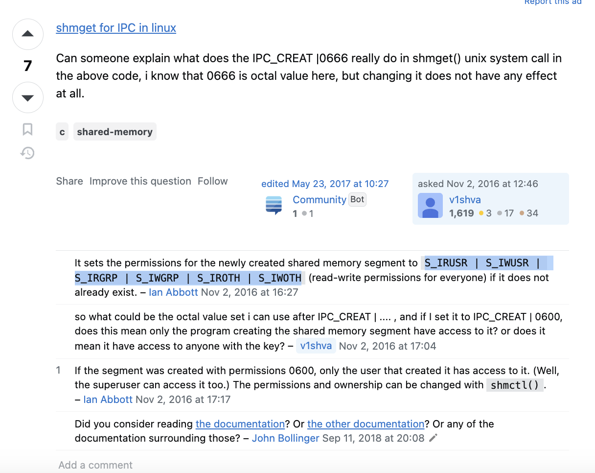

# How to Share Memory Between C++ and Python Programs

Documentation: https://users.cs.cf.ac.uk/Dave.Marshall/C/node27.html

## shmget()
A.k.a shared-memory-get
Obtains access to a shared memory segment

Prototype: **int shmget(key_t key, size_t size, int shmflg);**

- key: an access value associated with the *semaphore* ID
- size: the number of bytes the memory segment should have
- shmflg: flags set to indicate access rights and creation control flags

Typical control flags is IPC_CREAT | 0666
Meaning of this flag is explained in below image

[Source](https://stackoverflow.com/questions/40380327/what-is-the-use-of-ipc-creat-0666-flag-in-shmget-function-in-c)

## shmctl
A.k.a shared-memory-control
Alters the permissions (and other characteristics) of a shared memory segment

Prototype: **int shmctl(int shmid, int cmd, struct shmid_ds *buf);**

- shmid: id of memory segment; what yuo get from shmget()
- cmd: one of the following
    - SHM_LOCK: lock the specific shared memory segment in memory.
    - SHM_UNLOCK: unlock the specific shared memory segment in memory.
    - IPC_STAT: return the status info contained in the control structure and place it in the buffer *buf*
    - IPC_SET: set the effective user and group identification and access permissions.

## shmat() and shmdt()
A.k.a shared memory attach and shared memory detach

Prototype: **void *shmat(int shmid, const void *shmaddr, int shmflg);**

Returns an address, *shmaddr* to the head of the shared memory segment

Prototype: **int shmdt(const void *shmaddr);**

Detaches the shared memory segment pointed at *shmaddr*

